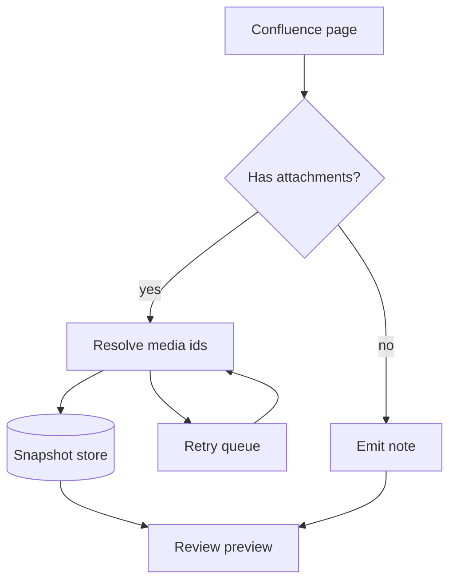

# Product Note Sample

The upload failed with `Invalid file id - UNKNOWN_MEDIA_ID`. The page depends on
those records in this snapshot, so the import has to be replayed before the
attachment resolves.

## Reproduction

```js
async function fetchPage(id) {
  const res = await client.get(`/wiki/api/v2/pages/${id}`, { expand: 'body.storage' });
  if (res.status !== 200) throw new Error(`page ${id} returned ${res.status}`);
  return res.data;   // caller normalises the storage format
}
```

```python
def replay(snapshot: Path, *, dry_run: bool = False) -> int:
    records = json.loads(snapshot.read_text())
    return sum(1 for r in records if not dry_run and upload(r))
```

```sql
SELECT page_id, COUNT(*) AS attachments
FROM   confluence_media
WHERE  media_id IS NULL
GROUP  BY page_id
ORDER  BY attachments DESC;
```

| Field | Value | Notes |
|---|---|---|
| `page_id` | 2647654401 | stable across versions |
| `version` | 4 | bumped on every publish |
| `media_id` | *missing* | the cause of the failure |

> The snapshot is authoritative for product intent, not for implementation.

- First item in a list
- Second item, which is longer and wraps onto another line so the gutter button
  has something taller to sit against
- Third item

## Flow


